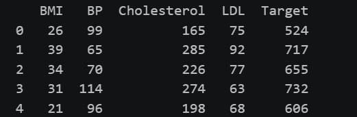
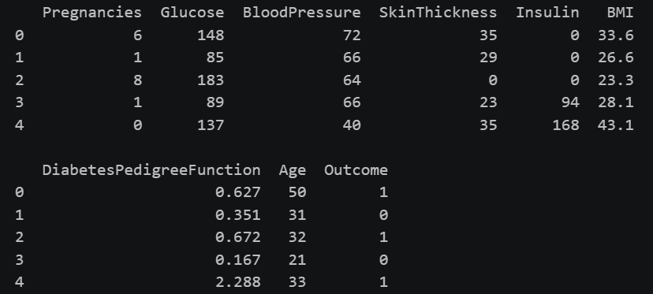

# Machine Learning From Scratch

This project contains implementations of **Linear Regression** and **Logistic Regression** built from scratch using Python, NumPy, and Pandas.

The main purpose of this project is to understand how machine learning algorithms work internally rather than relying on ready-made machine learning libraries for model training.

## Models Implemented

### 1. Linear Regression

Linear Regression is implemented from scratch using:

- Feature normalization
- Cost function
- Gradient calculation
- Gradient Descent
- Model prediction
- R² evaluation

The model learns the relationship between multiple input features and a continuous target value.
### Linear Regression Dataset

For the Linear Regression model, a diabetes-related dataset is used to predict a continuous target value based on patient health measurements such as BMI, blood pressure, cholesterol, and LDL levels.

The dataset is preprocessed before training, including separating the features and target, calculating feature statistics, and normalizing the input features to improve gradient descent.


### 2. Logistic Regression

Logistic Regression is implemented from scratch for binary classification.

The implementation includes:

- Data cleaning
- Handling missing/invalid zero values
- Median imputation
- Feature normalization
- Sigmoid function
- Logistic regression cost function
- Gradient calculation
- Gradient Descent
- Probability prediction
- Binary classification using a threshold
- Accuracy evaluation

The logistic regression model is used to predict a binary outcome from patient-related features.

---
## Dataset

The datasets used in this project were obtained from **Kaggle**.


For the Logistic Regression model, a diabetes dataset containing patient health measurements such as glucose level, blood pressure, BMI, insulin, and age is used to predict the binary `Outcome`.

The datasets are preprocessed before training, including handling invalid/missing values and feature normalization.

**Dataset Source:** [Kaggle - Diabetes Dataset](https://www.kaggle.com/datasets/mragpavank/diabetes/data)

## Project Structure

```text
Machine-Learning-From-Scratch/
│
├── images/
│   ├── linear_regression.png
│   └── logistic_regression.png
│
├── Linear-Regression/
│   └── Linear_Regression.ipynb
│
└── Logistic-Regression/
    └── Logistic_Regression.ipynb
